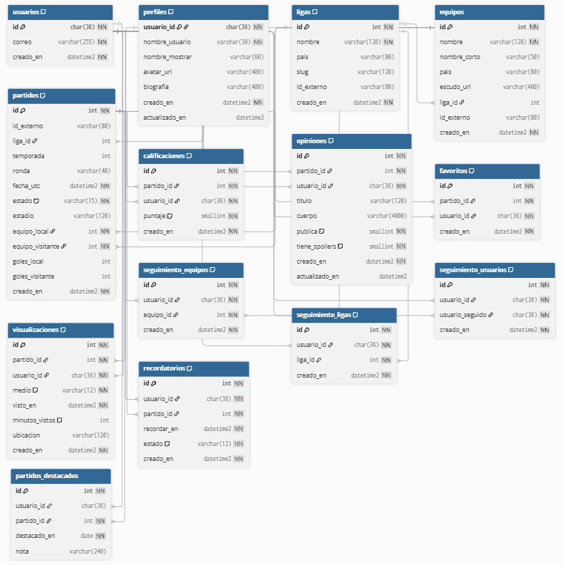

<div align="center">

  <!-- Banner -->
  <a href="https://github.com/tobiager/BD1-proyecto">
    
  </a>

  <!-- Badges -->
  <p>
    
    
    
    
  </p>

</div>

# BD1 — Proyecto de Estudio e Investigación  

**Tribuneros**: red social del fútbol para **registrar, puntuar y comentar** partidos.  
Este repositorio contiene la documentación y scripts SQL Server correspondientes al **trabajo práctico integrador de Bases de Datos I (FaCENA–UNNE)**.

---

## Índice
1. [Capítulo I — Introducción](#capítulo-i--introducción)  
   - [Tema](#tema)  
   - [Definición o planteamiento del problema](#definición-o-planteamiento-del-problema)  
   - [Objetivos del trabajo práctico](#objetivos-del-trabajo-práctico)  
2. [Capítulo IV — Desarrollo del tema / Resultados](#capítulo-iv--desarrollo-del-tema--resultados)  
   - [Esquema relacional](#esquema-relacional)  
   - [Script de creación (DDL)](#script-de-creación-ddl)  
   - [Carga representativa (DML)](#carga-representativa-dml)  
   - [Diccionario de datos](#diccionario-de-datos)  
3. [Estructura del repositorio](#estructura-del-repo)  
4. [Cómo ejecutar los scripts](#cómo-ejecutar-los-scripts)   
5. [Licencia](#licencia)  

---

## CAPÍTULO I — INTRODUCCIÓN  

### Tema  
**Tribuneros – Red social del fútbol para registrar, puntuar y comentar partidos.**  
El proyecto plantea el diseño e implementación de un **modelo de datos relacional** que soporte una aplicación social destinada a los aficionados al fútbol.  

### Definición o planteamiento del problema  
Los aficionados no cuentan con una herramienta unificada que les permita:  
- Registrar los partidos que vieron, con fecha, marcador y medio de visualización.  
- Calificar y escribir opiniones, con opciones de privacidad y control de spoilers.  
- Marcar favoritos, seguir equipos de interés y programar recordatorios.  
- Consultar partidos destacados seleccionados por curaduría.  

Hoy esa información se encuentra dispersa en apps de resultados, redes sociales y notas personales. Esto genera **pérdida de registros**, menor participación y falta de estadísticas personalizadas.  

### Objetivos del trabajo práctico  

**Objetivo general**  
Diseñar y documentar un modelo de datos relacional para Tribuneros, asegurando integridad, consistencia y escalabilidad.  

**Objetivos específicos**  
- Definir entidades, relaciones y restricciones de integridad.  
- Elaborar un esquema relacional normalizado.  
- Implementar el modelo en SQL Server con **scripts DDL/DML**.  
- Documentar diccionario de datos y justificación de diseño.  
- Versionar en GitHub para trazabilidad y reproducibilidad.  

---

## CAPÍTULO IV — DESARROLLO DEL TEMA / RESULTADOS  

### Esquema relacional  
  

Entidades principales:  
- **Usuarios** (`users`, `user_profiles`)  
- **Catálogos** (`leagues`, `teams`)  
- **Partidos** (`matches`)  
- **Interacciones** (`match_ratings`, `match_opinions`, `favorites`, `views`)  
- **Social** (`follow_teams`)  
- **Curaduría y extras** (`featured_matches`, `reminders`)  

**Highlights de diseño**  
- PK/FK y **UNIQUE** en combinaciones clave (`match_id,user_id`).  
- **CHECK** para estados (`status`, `medium`, `reminder_status`).  
- `ON DELETE CASCADE` en relaciones de usuario; `RESTRICT/SET NULL` en catálogos.  
- Índices por `date_utc`, `league_id`, `user_id` para consultas frecuentes.  

---

### Script de creación (DDL)  
📂 [`script/creacion.sql`](./script/creacion.sql)  

Incluye:  
- Tablas con claves primarias y foráneas.  
- Restricciones `NOT NULL`, `UNIQUE`, `CHECK`.  
- Índices de apoyo para rendimiento.  

Ejemplo:  

```sql
CREATE TABLE dbo.match_ratings (
  id BIGINT IDENTITY PRIMARY KEY,
  match_id BIGINT NOT NULL FOREIGN KEY REFERENCES dbo.matches(id) ON DELETE CASCADE,
  user_id UNIQUEIDENTIFIER NOT NULL FOREIGN KEY REFERENCES dbo.users(id) ON DELETE CASCADE,
  rating TINYINT NOT NULL CHECK (rating BETWEEN 1 AND 5),
  created_at DATETIME2 NOT NULL DEFAULT SYSUTCDATETIME(),
  CONSTRAINT UQ_ratings UNIQUE(match_id, user_id)
);
```  

---

### Carga representativa (DML)  
📂 [`script/carga_inicial.sql`](./script/carga_inicial.sql)  

Incluye:  
- 2 usuarios de prueba.  
- Ligas: Primera División Argentina y Copa Libertadores.  
- Equipos: River Plate, Boca Juniors, Fluminense.  
- Partido cargado: River vs Boca (Clásico).  
- Datos de interacción: rating, opinión, favorito, recordatorio.  

---

### Diccionario de datos  

| Tabla | Columna | Tipo | Regla | Descripción |
|---|---|---|---|---|
| `users` | `id` | UNIQUEIDENTIFIER | PK, `DEFAULT NEWID()` | Identificador del usuario |
| `users` | `email` | NVARCHAR(255) | UNIQUE, NOT NULL | Correo de acceso |
| `user_profiles` | `username` | NVARCHAR(30) | UNIQUE, NOT NULL | Alias público |
| `matches` | `status` | NVARCHAR(15) | CHECK estados válidos | Estado del partido |
| `match_ratings` | `rating` | TINYINT | CHECK 1–5 | Puntuación del partido |
| `views` | `medium` | NVARCHAR(12) | CHECK valores válidos | Medio de visualización |
| `follow_teams` | `(user_id,team_id)` | — | UNIQUE | Un usuario sigue un equipo una sola vez |
| `reminders` | `status` | NVARCHAR(12) | CHECK valores válidos | Estado del recordatorio |

> El **diccionario completo** se encuentra en el documento PDF (carpeta `documento/`).  

---

## Estructura del repo
```txt
.
├─ documento/
│  └─ BDI_grupoXX_v1.pdf       # Documento académico (Cap. I y IV)
├─ script/
│  ├─ creacion.sql             # DDL: tablas y restricciones
│  └─ carga_inicial.sql        # DML: datos representativos
├─ assets/
│  ├─ banner-bdi.jpg
│  ├─ der-tribuneros.png
│  └─ badge-bdi.png
├─ README.md
└─ LICENSE
```

---

## Cómo ejecutar los scripts
Requisitos: **SQL Server** + **SSMS 19/20**.  

```sql
-- Crear esquema
:r .\script\creacion.sql

-- Insertar datos
:r .\script\carga_inicial.sql

-- Consultas de prueba
SELECT * FROM dbo.matches;
SELECT * FROM dbo.match_ratings;
```

---

## Licencia
- **Código SQL**: MIT  
- **Documento académico**: CC BY-NC-SA 4.0  

<div align="center">
  <br/>
  <br/>
  <sub>Hecho con ⚽ y 💾 — FaCENA · UNNE</sub>
</div>
