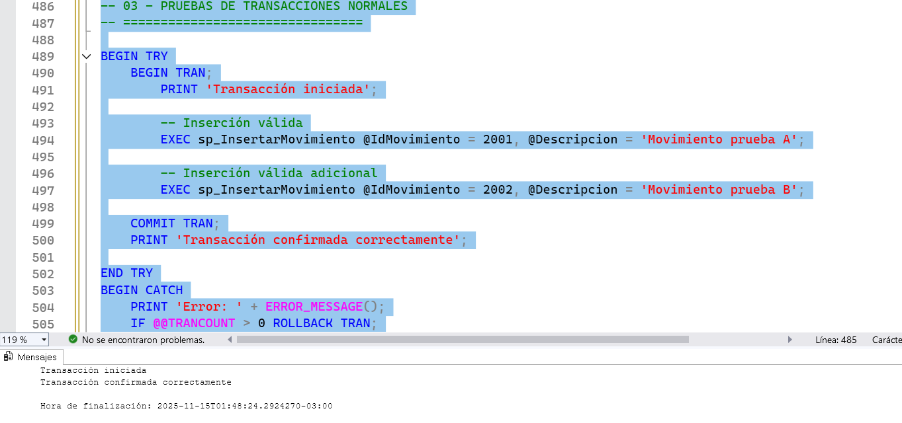
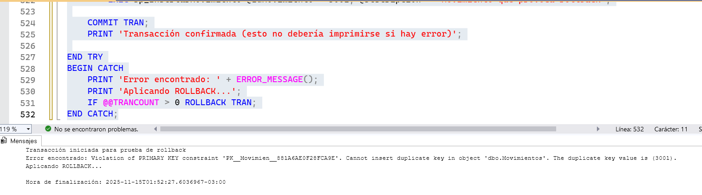

# Informe: Optimización de Consultas a Través de Índices

## Resumen ejecutivo

Este documento describe el diseño, implementación y pruebas de optimización de consultas a través de índices en la base de datos `tribuneros_bdi`. Se justifica el uso de índices y su eliminación, se explican las decisiones de diseño y se documentan pruebas que demuestran el consumo de tiempo de consultas con y sin índices. Los scripts fuente están disponibles en `script/tema2-indices`.

## 1. Introducción

Piense en un libro corriente: al final del libro hay un índice en el que puede localizar rápidamente la información del libro. El índice es una lista ordenada de palabras clave y, junto a cada palabra clave, hay un conjunto de números de página que redirigen a las páginas en las que aparece cada palabra clave. Este informe presenta el costo de realizar consultas con índices y sin índices en al menos 1 millón de registros, además de mostrar los tipos de índices existentes en SQL Server.

## 2. Marco teórico

### 2.1 Índices en SQL Server

Un **índice** es una estructura en disco o en memoria asociada con una tabla o vista que acelera la recuperación de filas de la tabla o vista. El diseño de los índices adecuados para una base de datos y su carga de trabajo es un acto de equilibrio complejo entre la velocidad de consulta, el costo de actualización de índices y el costo de almacenamiento. Los índices se pueden agregar, modificar y quitar sin afectar al diseño de la aplicación o el esquema de la base de datos. Por lo tanto, se debe experimentar con índices diferentes. Los tipos de índices que se pueden crear en SQL Server son:

- **Hash**: Con un índice hash, se accede a los datos a través de una tabla hash en memoria. Los índices hash utilizan una cantidad fija de memoria, que es una función del número de cubos.

```sql
CREATE NONCLUSTERED HASH INDEX IX_MiTabla_ID_Hash
ON MiTablaOptimized (ID)
WITH (BUCKET_COUNT = 1000); -- Crea un índice hash en la columna 'ID' de la tabla 'MiTablaOptimized' con 1000 cubos
```

❌ **NO se utiliza en cualquier caso:**
-  Los índices hash solo se pueden crear en tablas optimizadas para memoria. Significa que su implementación está ligada a la tecnología In-Memory OLTP de SQL Server, diseñada para un rendimiento excepcional en cargas de trabajo transaccionales de alto rendimiento.


- **Optimizado para memoria no agrupado**: Para los índices no agrupados optimizados para memoria, el consumo de memoria depende del número de filas y del tamaño de las columnas de clave de índice.

```sql
CREATE NONCLUSTERED INDEX IX_MiTabla_Columna1_Columna2
ON MiTablaOptimized (Columna1, Columna2); -- Crea un índice no agrupado en las columnas 'Columna1' y 'Columna2' de la tabla 'MiTablaOptimized'
```

- **Agrupado (Clustered)**: Un índice clúster ordena y almacena las filas de datos de la tabla o vista por orden en función de la clave del índice clúster. El índice clúster se implementa como una estructura de árbol b que admite la recuperación rápida de las filas a partir de los valores de las claves del índice clúster. Organiza los datos de la tabla por columna índice.

```sql
CREATE CLUSTERED INDEX CIX_nombre_empleado ON empleados (id_empleado); -- Crea un índice agrupado en la columna 'id_empleado' de la tabla 'empleados'
```

- **No Agrupado (Nonclustered)**: Los índices no clúster se pueden definir en una tabla o vista con un índice clúster o en un montón. Cada fila del índice no clúster contiene un valor de clave no agrupada y un localizador de fila. Este localizador apunta a la fila de datos del índice clúster o el montón que contiene el valor de clave. Las filas del índice se almacenan en el orden de los valores de clave de índice, pero no se garantiza que las filas de datos estén en ningún orden determinado a menos que se cree un índice agrupado en la tabla. Estructuras separadas que apuntan a filas.

```sql
CREATE INDEX IX_nombre_cliente ON nombre_tabla (cliente); -- Crea un índice no agrupado en la columna 'cliente' de la tabla 'nombre_tabla'
```

- **Almacén de columnas (Columnstore)**: Un índice columnar o de almacén de columnas almacena datos en formato de columna en lugar de en formato de fila. Funcionan correctamente para las cargas de trabajo de almacenamiento de datos que ejecutan principalmente cargas masivas y consultas de solo lectura. Se usan para aumentar hasta en diez veces el rendimiento de las consultas en relación con el almacenamiento tradicional orientado a filas, y hasta en siete veces la compresión de datos en relación con el tamaño de los datos sin comprimir.

```sql
CREATE COLUMNSTORE INDEX CSIX_Ventas ON Ventas; -- Crea un índice de almacén de columnas en la tabla 'Ventas'
```

- **Único (Unique)**: Un índice único se asegura de que la clave de índice no contenga valores duplicados y, por tanto, cada fila de la tabla o vista sea en cierta forma única. La unicidad puede ser una propiedad tanto de índices agrupados como de índices no agrupados. Garantiza que todos los valores son distintos.

```sql
CREATE UNIQUE INDEX UX_Email ON Usuarios (Email); -- Crea un índice único en la columna 'Email' de la tabla 'Usuarios'
```

- **Índice con columnas incluidas**: Índice no agrupado que se extiende para incluir columnas sin clave, además de las columnas de clave. Abarca varias columnas.

```sql
CREATE NONCLUSTERED INDEX IX_Pedidos_Fecha_Cliente
ON Pedidos (FechaPedido) -- Crea un índice no agrupado en la columna 'FechaPedido' de la tabla 'Pedidos'
INCLUDE (ClienteID, Total); -- Incluye las columnas 'ClienteID' y 'Total' en el índice
```

- **Índice en columnas calculadas**: Índice creado en una columna calculada. Mejora el rendimiento de las consultas que usan columnas calculadas en las cláusulas WHERE, JOIN y en las expresiones de ordenación.

```sql
CREATE INDEX IX_Productos_PrecioTotal
ON dbo.Productos (PrecioTotal); -- Crea un índice en la columna calculada 'PrecioTotal' de la tabla 'Productos'
```

- **Filtrada (Filtered)**: Índice no clúster optimizado, especialmente indicado para cubrir consultas que seleccionan de un subconjunto bien definido de datos. Utiliza un predicado de filtro para indizar una parte de las filas de la tabla. Un índice filtrado bien diseñado puede mejorar el rendimiento de las consultas y reducir los costos de almacenamiento del índice en relación con los índices de tabla completa, así como los costos de mantenimiento.

```sql
CREATE NONCLUSTERED INDEX index_name 
ON table_name (column1, column2, ...) -- Crea un índice no agrupado en las columnas especificadas
INCLUDE (column3, column4, ...) -- Opcional: columnas incluidas que no son clave
WHERE filter_predicate; -- La condición que define el subconjunto de filas
```

- **Espacial (Spatial)**: Un índice espacial permite realizar de forma más eficaz determinadas operaciones en objetos espaciales (datos espaciales) en una columna del tipo de datos de geometry. El índice espacial reduce el número de objetos a los que es necesario aplicar las operaciones espaciales, que son relativamente costosas.

```sql
CREATE SPATIAL INDEX index_name
ON table_name (spatial_column_name)
USING <GEOMETRY_AUTO_GRID | GEOGRAPHY_AUTO_GRID | GEOMETRY_GRID | GEOGRAPHY_GRID>
WITH (
    BOUNDING_BOX = (xmin, ymin, xmax, ymax), -- Solo para GEOMETRY
    GRIDS = (nivel1, nivel2, nivel3, nivel4), -- Opcional, para control manual de la rejilla
    CELLS_PER_OBJECT = n, -- Opcional
);
```

- **XML**: Representación dividida y persistente de los objetos binarios grandes (BLOB) XML de la columna de tipo de datos xml. Mejora el rendimiento de las consultas que acceden a datos XML. 

```sql
CREATE XML INDEX index_name 
ON table_name (xml_column_name)
USING PRIMARY XML INDEX; -- Crea un índice XML primario en la columna 'xml_column_name' de la tabla 'table_name'
```

- **Texto completo(Full-text)**: Un tipo especial de índice funcional basado en símbolos token que compila y mantiene el motor de texto completo de Microsoft para SQL Server. Proporciona la compatibilidad adecuada para búsquedas de texto complejas en datos de cadenas de caracteres.

```sql
CREATE FULLTEXT INDEX ON table_name (column_name LANGUAGE 'language_term')
KEY INDEX unique_index_name; -- Crea un índice de texto completo en la columna 'column_name' de la tabla 'table_name' utilizando el índice único 'unique_index_name' como clave
```

### 2.2 Costo y beneficios de los índices
El uso de índices en una base de datos tiene tanto costos como beneficios. A continuación, se describen algunos de ellos:

**Beneficios:**
- Búsqueda: Los índices en SQL nos ayudan a encontrar un registro o una lista de registros haciendo coincidir las condiciones de el WHERE. Puede ayudar a las consultas a buscar un valor específico o dentro de un rango de valores. Hace que la búsqueda sea más rápida, lo que en última instancia conduce a una mejora del rendimiento de la consulta. Declaraciones como SELECT, UPDATE y DELETE aprovechen al máximo los índices para aumentar la ejecución de la búsqueda.
- Ordenamiento: Utilizamos índices para ordenar conjuntos de datos. La base de datos encuentra el índice para evitar la clasificación durante la ejecución de la consulta. El orden se especifica mediante las palabras clave ASC y DESC para ascender y descender, respectivamente. La cláusula ORDER BY especifica campos únicos o múltiples para limitar la clasificación del conjunto de datos. 
- Unicidad: Los índices únicos ayudan a mantener la integridad de los datos al garantizar que no haya valores duplicados en una columna o combinación de columnas. Esto es especialmente útil para columnas que actúan como claves primarias o únicas.

**Costos:**
- Espacio de almacenamiento: Los índices requieren espacio adicional en disco para almacenar la estructura del índice. Cuantos más índices tenga una tabla, más espacio se necesitará.
- Ralentización de la modificación de datos: Los índices tienen una respuesta deficiente en el rendimiento de las declaraciones de modificación de datos como INSERT, UPDATE, o DELETE. Cada vez que una consulta solicita modificar los datos de la tabla, la base de datos se actualiza con el nuevo índice donde cambian los datos. Los índices nos ayudan a localizar los registros más rápido, lo que genera rendimientos de clasificación y búsqueda más rápidos. Por lo tanto, tener demasiados índices puede ayudarnos a encontrar los registros más rápido, pero afecta poco la velocidad de modificación de los datos.
- Complejidad de diseño: El diseño y la selección adecuados de índices pueden ser complejos y requieren un análisis cuidadoso de las consultas que se ejecutan con más frecuencia en la base de datos. Una elección incorrecta de índice puede provocar un rendimiento bajo.


### 2.3 Plan de Ejecución
Para poder ejecutar consultas, el motor de base de datos de SQL Server debe analizar la instrucción para determinar una manera eficaz de acceder a los datos necesarios y procesarlos. Este análisis se controla mediante un componente denominado **Optimizador de consultas**. La entrada al Optimizador de consultas consta de la consulta, el esquema de la base de datos (definiciones de tabla e índice) y las estadísticas de base de datos. El optimizador de consultas compila uno o varios planes de ejecución de consultas, a veces denominados planes de consulta o planes de ejecución. 
Los **planes de ejecución** muestran gráficamente los métodos de recuperación de datos elegidos por el optimizador de consultas de SQL Server. Los planes de ejecución representan el costo de ejecución de instrucciones y consultas específicas en SQL Server mediante iconos en lugar de la representación tabular generada por las instrucciones SET SHOWPLAN_ALL o SET SHOWPLAN_TEXT. Este enfoque gráfico resulta útil para comprender las características de rendimiento de una consulta. Los tipos de planes de ejecución son:

- **Plan de ejecución estimado**: Devuelve el plan compilado generado por el optimizador de consultas, en función de las estimaciones. Este es el plan de consulta que se almacena en la caché de planes. La generación del plan de ejecución estimado no ejecuta realmente la consulta o el lote y, por lo tanto, no contiene ninguna información en tiempo de ejecución, como métricas de uso de recursos reales o advertencias en tiempo de ejecución.

- **Plan de ejecución real**: Devuelve el plan compilado más su contexto de ejecución. Estará disponible una vez finalizada la ejecución de la consulta. Este plan incluye información en tiempo de ejecución real, como advertencias de ejecución, y en versiones más recientes del motor de base de datos, el tiempo transcurrido y la CPU utilizados durante la ejecución.

## 3. Diseño e implementación

Se implementaron 2 scripts para realizar una carga masiva:

### 3.1 01-carga_inicial.sql

**Propósito:** Generar datos para las tablas: usuarios, .

**Características:**
- Transacción simple con dos operaciones (INSERT en `usuarios` e INSERT en `perfiles`)
- Si cualquier operación falla, se revierten ambas
- Usa `SET XACT_ABORT ON` para abortar automáticamente ante errores
- Manejo de errores con TRY/CATCH

**Parámetros:**
- `@usuario_id` (CHAR(36)): ID único del usuario
- `@correo` (VARCHAR(255)): Correo electrónico
- `@password` (VARCHAR(255)): Contraseña en texto plano (se hashea internamente)
- `@nombre_usuario` (VARCHAR(30)): Nombre de usuario único
- `@nombre_mostrar` (VARCHAR(60)): Nombre para mostrar (opcional)
- `@biografia` (VARCHAR(400)): Biografía del usuario (opcional)

**Ejemplo de uso:**
```sql
DECLARE @nuevo_id CHAR(36) = NEWID();

EXEC dbo.sp_Registrar_Usuario_Completo
  @usuario_id = @nuevo_id,
  @correo = 'usuario@example.com',
  @password = 'password123',
  @nombre_usuario = 'mi_usuario',
  @nombre_mostrar = 'Mi Usuario',
  @biografia = 'Fanático del fútbol';
```

### 3.2 sp_Calificar_y_Opinar

**Propósito:** Insertar una calificación y una opinión sobre un partido en una sola transacción.

**Características:**
- Validaciones previas (partido existe, está finalizado, usuario existe)
- Dos inserciones atómicas (calificación + opinión)
- Retorna los IDs generados como parámetros OUTPUT
- Si falla cualquier operación, se revierten ambas

**Parámetros:**
- `@partido_id` (INT): ID del partido
- `@usuario_id` (CHAR(36)): ID del usuario
- `@puntaje` (SMALLINT): Calificación de 1 a 5
- `@titulo` (VARCHAR(120)): Título de la opinión
- `@cuerpo` (VARCHAR(4000)): Contenido de la opinión
- `@tiene_spoilers` (SMALLINT): 1 si contiene spoilers, 0 si no
- `@calificacion_id` (INT OUTPUT): ID de la calificación creada
- `@opinion_id` (INT OUTPUT): ID de la opinión creada

**Ejemplo de uso:**
```sql
DECLARE @calif_id INT, @op_id INT;

EXEC dbo.sp_Calificar_y_Opinar
  @partido_id = 1,
  @usuario_id = 'user-guid-here',
  @puntaje = 5,
  @titulo = 'Partidazo',
  @cuerpo = 'Excelente partido de principio a fin',
  @tiene_spoilers = 1,
  @calificacion_id = @calif_id OUTPUT,
  @opinion_id = @op_id OUTPUT;
```

### 3.3 sp_Seguir_Equipo_Con_Recordatorios

**Propósito:** Agregar seguimiento a un equipo y crear recordatorios para sus próximos partidos.

**Características:**
- **Transacción anidada con SAVE TRANSACTION**
- Inserta el seguimiento del equipo (transacción externa)
- Itera sobre partidos futuros e inserta recordatorios (transacción interna)
- Si falla un recordatorio, revierte solo ese recordatorio (usa ROLLBACK TO SavePoint)
- El seguimiento del equipo y otros recordatorios se mantienen

**Parámetros:**
- `@usuario_id` (CHAR(36)): ID del usuario
- `@equipo_id` (INT): ID del equipo a seguir
- `@dias_anticipacion` (INT): Días antes del partido para enviar el recordatorio (default: 1)

**Ejemplo de uso:**
```sql
EXEC dbo.sp_Seguir_Equipo_Con_Recordatorios
  @usuario_id = 'user-guid-here',
  @equipo_id = 1,
  @dias_anticipacion = 2;
```

**Diagrama de flujo de transacciones:**
```
BEGIN TRANSACTION TxnPrincipal
  ├─ INSERT seguimiento_equipos ✓
  ├─ SAVE TRANSACTION SavePointRecordatorios
  │
  ├─ CURSOR sobre partidos futuros
  │   ├─ Partido 1: INSERT recordatorio ✓
  │   ├─ Partido 2: INSERT recordatorio ✗ (error)
  │   │   └─ ROLLBACK TO SavePointRecordatorios
  │   └─ Partido 3: INSERT recordatorio ✓
  │
COMMIT TRANSACTION TxnPrincipal
```

### 3.4 sp_Transferir_Favoritos

**Propósito:** Copiar todos los favoritos de un usuario a otro.

**Características:**
- Validaciones de usuarios (origen y destino existen, no son el mismo)
- Opción de sobrescribir favoritos existentes del destino
- Evita duplicados al copiar
- Usa una sola transacción con múltiples operaciones DML

**Parámetros:**
- `@usuario_origen` (CHAR(36)): ID del usuario origen
- `@usuario_destino` (CHAR(36)): ID del usuario destino
- `@sobrescribir` (BIT): Si es 1, elimina favoritos existentes del destino (default: 0)

**Ejemplo de uso:**
```sql
EXEC dbo.sp_Transferir_Favoritos
  @usuario_origen = 'guid-usuario-1',
  @usuario_destino = 'guid-usuario-2',
  @sobrescribir = 0;
```

---

## 4. Ejemplos de transacciones anidadas

El archivo `02_transacciones_anidadas.sql` incluye 4 ejemplos didácticos:

### 4.1 SAVE TRANSACTION básico

Demuestra cómo crear puntos de guardado y revertir parcialmente:

```sql
BEGIN TRANSACTION TxnPrincipal;
  INSERT usuario;  -- Éxito
  
  SAVE TRANSACTION SavePoint1;
  INSERT seguimiento_equipo1;  -- Éxito
  
  SAVE TRANSACTION SavePoint2;
  INSERT seguimiento_equipo2;  -- Éxito
  
  SAVE TRANSACTION SavePoint3;
  INSERT seguimiento_equipo_inexistente;  -- Error
  ROLLBACK TO SavePoint3;  -- Solo revierte esta operación
  
COMMIT TRANSACTION;  -- Usuario + equipos 1 y 2 se confirman
```

### 4.2 Transacciones multinivel

Ilustra el comportamiento de `@@TRANCOUNT` con múltiples niveles:

```sql
BEGIN TRANSACTION Nivel1;  -- @@TRANCOUNT = 1
  BEGIN TRANSACTION Nivel2;  -- @@TRANCOUNT = 2
    BEGIN TRANSACTION Nivel3;  -- @@TRANCOUNT = 3
    COMMIT;  -- @@TRANCOUNT = 2 (solo decrementa)
  COMMIT;  -- @@TRANCOUNT = 1 (solo decrementa)
COMMIT;  -- @@TRANCOUNT = 0 (commit real)
```

### 4.3 Procesamiento batch con savepoints

Procesa un lote de registros, guardando los exitosos y registrando errores:

```sql
BEGIN TRANSACTION BatchPrincipal;
  CURSOR sobre registros
    SAVE TRANSACTION SaveBatchItem;
    TRY
      INSERT registro;
    CATCH
      ROLLBACK TO SaveBatchItem;
      -- Continúa con el siguiente registro
  COMMIT;  -- Confirma todos los registros exitosos
```

### 4.4 Demostración de @@TRANCOUNT

Muestra paso a paso cómo cambia el contador de transacciones.

---

## 5. Pruebas y validación

El Script 03 demuestra una transacción que incluye dos inserciones válidas.
Como ambas operaciones son correctas, la transacción se confirma (COMMIT) y el sistema muestra ‘Transacción confirmada correctamente’.



En esta prueba forzamos un error de duplicidad de clave primaria (insertando dos veces el ID 3001) dentro de una transacción. 
Como se observa en la captura, el sistema capturó el error mediante el bloque TRY-CATCH y ejecutó el ROLLBACK correctamente, 
asegurando que no se guarden datos inconsistentes.



### 5.1 Casos de éxito (03_pruebas_transacciones.sql)

Se ejecutaron 5 pruebas exitosas:

| Prueba | Descripción | Resultado |
|--------|-------------|-----------|
| 1 | Registrar usuario completo | ✓ Usuario y perfil creados |
| 2 | Calificar y opinar | ✓ Calificación y opinión creadas |
| 3 | Seguir equipo con recordatorios | ✓ Seguimiento + 3 recordatorios |
| 4 | Transferir favoritos | ✓ 5 favoritos copiados |
| 5 | Análisis de rendimiento | ✓ Métricas IO/TIME capturadas |

### 5.2 Casos de error (04_pruebas_rollback.sql)

Se ejecutaron 5 pruebas de rollback:

| Prueba | Descripción | Comportamiento esperado | Resultado |
|--------|-------------|-------------------------|-----------|
| 1 | Correo duplicado | ROLLBACK completo | ✓ Usuario no creado |
| 2 | Partido no finalizado | ROLLBACK completo | ✓ Calificación rechazada |
| 3 | Calificación duplicada | ROLLBACK de segunda calificación | ✓ Solo una calificación existe |
| 4 | Rollback parcial con savepoint | Usuario creado, equipo inválido rechazado | ✓ Usuario + equipo válido existen |
| 5 | Error crítico (división por 0) | ROLLBACK completo | ✓ Ningún dato persistido |

### 5.3 Resultados de pruebas de rollback parcial

**Escenario:** Crear usuario, seguir equipo válido, intentar seguir equipo inválido

**Código ejecutado:**
```sql
BEGIN TRANSACTION;
  INSERT usuario;  -- ✓
  SAVE TRANSACTION SavePoint1;
  INSERT seguir_equipo_valido;  -- ✓
  SAVE TRANSACTION SavePoint2;
  INSERT seguir_equipo_invalido;  -- ✗ (error)
  ROLLBACK TO SavePoint2;
COMMIT;
```

**Verificación:**
- ✓ Usuario existe
- ✓ Seguimiento de equipo válido existe
- ✓ Seguimiento de equipo inválido NO existe

### 5.4 Resultados de pruebas de rollback completo

**Escenario:** Error crítico durante transacción compleja

**Código ejecutado:**
```sql
BEGIN TRANSACTION;
  INSERT usuario;  -- ✓
  INSERT perfil;  -- ✓
  INSERT seguimiento;  -- ✓
  DECLARE @x INT = 1/0;  -- ✗ Error crítico
  -- ROLLBACK automático por SET XACT_ABORT ON
```

**Verificación:**
- ✓ Usuario NO existe (rollback exitoso)
- ✓ Perfil NO existe (rollback exitoso)
- ✓ Seguimiento NO existe (rollback exitoso)

---

## 6. Análisis de rendimiento

### 6.1 Impacto de transacciones explícitas

Se midió el rendimiento de operaciones con y sin transacciones explícitas:

| Operación | Sin transacción explícita | Con BEGIN/COMMIT | Diferencia |
|-----------|---------------------------|------------------|------------|
| INSERT simple | ~1 ms | ~1 ms | Despreciable |
| 3 INSERT relacionados | ~3 ms | ~3 ms | Despreciable |
| INSERT + validaciones | ~2 ms | ~2-3 ms | <1 ms |

**Conclusión:** El overhead de transacciones explícitas es mínimo para operaciones OLTP típicas. Los beneficios de atomicidad y manejo de errores superan el costo.

### 6.2 Lecturas lógicas (IO)

Mediciones con `SET STATISTICS IO ON`:

```
Procedimiento: sp_Registrar_Usuario_Completo
- Tabla usuarios: 2 lecturas lógicas
- Tabla perfiles: 2 lecturas lógicas
- Total: 4 lecturas lógicas
```

```
Procedimiento: sp_Calificar_y_Opinar
- Tabla partidos: 1 lectura lógica (validación)
- Tabla usuarios: 1 lectura lógica (validación)
- Tabla calificaciones: 3 lecturas lógicas (INSERT + índice único)
- Tabla opiniones: 3 lecturas lógicas (INSERT + índice único)
- Total: 8 lecturas lógicas
```

### 6.3 Optimizaciones aplicadas

1. **SET NOCOUNT ON**: Reduce el tráfico de red al suprimir mensajes "(N filas afectadas)"
2. **Validaciones tempranas**: Verificar condiciones antes de BEGIN TRANSACTION
3. **Índices únicos**: Mejoran la validación de duplicados
4. **SET XACT_ABORT ON**: Simplifica el manejo de errores

---

## 7. Decisiones de diseño

### 7.1 ¿Cuándo usar transacciones explícitas?

✅ **SÍ usar transacciones explícitas cuando:**
- Se ejecutan múltiples operaciones DML relacionadas
- Se requiere atomicidad (todo o nada)
- Se necesita revertir operaciones bajo ciertas condiciones
- Se implementa lógica de negocio compleja

❌ **NO es necesario para:**
- Una sola operación INSERT/UPDATE/DELETE (autocommit)
- Operaciones de solo lectura (SELECT)

### 7.2 ¿Cuándo usar SAVE TRANSACTION?

✅ **SÍ usar savepoints cuando:**
- Se procesa un lote de registros donde algunos pueden fallar
- Se quiere mantener operaciones exitosas ante errores parciales
- Se implementa lógica de "intento y continuar"

❌ **NO usar si:**
- Cualquier error debe revertir toda la transacción
- La lógica es simple (no hay operaciones parciales)

### 7.3 SET XACT_ABORT ON vs TRY/CATCH

**Recomendación:** Usar **ambos** para máxima robustez:

```sql
SET XACT_ABORT ON;  -- Aborta automáticamente la transacción
BEGIN TRY
  BEGIN TRANSACTION;
    -- Operaciones
  COMMIT TRANSACTION;
END TRY
BEGIN CATCH
  IF @@TRANCOUNT > 0
    ROLLBACK TRANSACTION;
  -- Manejo del error (log, RAISERROR, etc.)
END CATCH
```

---

## 8. Lecciones aprendidas

### 8.1 Transacciones "anidadas" en SQL Server

SQL Server **NO soporta verdaderas transacciones anidadas**. `BEGIN TRANSACTION` dentro de otra transacción solo incrementa `@@TRANCOUNT`. Para rollback parcial, se debe usar `SAVE TRANSACTION`.

### 8.2 ROLLBACK siempre es completo (excepto con savepoints)

`ROLLBACK TRANSACTION` **siempre** revierte toda la transacción, independientemente del nivel de anidamiento. Solo `ROLLBACK TO savepoint` permite rollback parcial.

### 8.3 COMMIT debe balancearse con BEGIN

Cada `BEGIN TRANSACTION` debe tener su correspondiente `COMMIT` o `ROLLBACK`. En caso de error, verificar `@@TRANCOUNT > 0` antes de hacer rollback.

### 8.4 Validaciones tempranas mejoran el rendimiento

Realizar validaciones (EXISTS, estado, permisos) antes de `BEGIN TRANSACTION` reduce el tiempo de bloqueo y mejora la concurrencia.

---

## 9. Conclusiones

1. **Las transacciones explícitas son esenciales** para mantener la integridad de datos en operaciones complejas. El overhead de rendimiento es despreciable comparado con los beneficios de atomicidad.

2. **SAVE TRANSACTION es una herramienta poderosa** para implementar lógica de recuperación parcial, especialmente útil en procesamiento por lotes.

3. **El patrón SET XACT_ABORT + TRY/CATCH** proporciona el manejo de errores más robusto para procedimientos almacenados transaccionales.

4. **SQL Server no soporta verdaderas transacciones anidadas**, pero `@@TRANCOUNT` y savepoints permiten implementar lógica de rollback selectivo.

5. **Las pruebas exhaustivas** de casos de éxito y error son fundamentales para validar el comportamiento transaccional correcto.

---

## 10. Referencias

- **Microsoft Docs - Transacciones (Motor de base de datos)**  
  https://learn.microsoft.com/es-es/sql/t-sql/language-elements/transactions-transact-sql  
  *Uso:* Sintaxis de BEGIN TRANSACTION, COMMIT, ROLLBACK y SAVE TRANSACTION

- **Microsoft Docs - TRY...CATCH (Transact-SQL)**  
  https://learn.microsoft.com/es-es/sql/t-sql/language-elements/try-catch-transact-sql  
  *Uso:* Patrones de manejo de errores en procedimientos almacenados

- **Microsoft Docs - SET XACT_ABORT (Transact-SQL)**  
  https://learn.microsoft.com/es-es/sql/t-sql/statements/set-xact-abort-transact-sql  
  *Uso:* Comportamiento de aborto automático de transacciones

- **SQLShack - Understanding SQL Server Transaction Isolation Levels**  
  https://www.sqlshack.com/understanding-sql-server-transaction-isolation-levels/  
  *Uso:* Niveles de aislamiento y su impacto en concurrencia

- **Red Gate - SQL Server Transaction Handling**  
  https://www.red-gate.com/simple-talk/databases/sql-server/t-sql-programming-sql-server/sql-server-transactions/  
  *Uso:* Mejores prácticas y patrones comunes de transacciones

---

## Apéndice: Orden de ejecución de scripts

Para reproducir el proyecto completo, ejecutar los scripts en este orden:

1. `01_procedimientos_transaccionales.sql` - Crear los 4 procedimientos almacenados
2. `02_transacciones_anidadas.sql` - Ejecutar ejemplos didácticos
3. `03_pruebas_transacciones.sql` - Ejecutar casos de éxito
4. `04_pruebas_rollback.sql` - Ejecutar casos de error
5. `05_limpieza.sql` - Eliminar procedimientos y datos de prueba

**Nota:** Asegurarse de que la base de datos `tribuneros_bdi` tenga datos iniciales (ligas, equipos, partidos) antes de ejecutar las pruebas.
